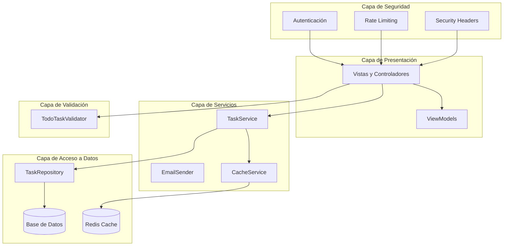
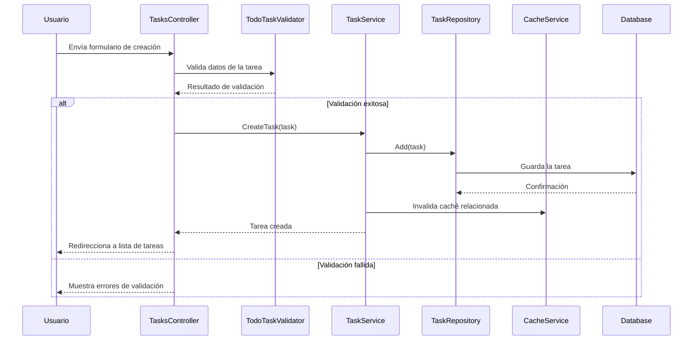
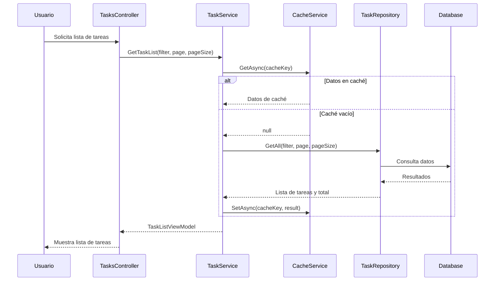

# Arquitectura General del Sistema

## Resumen

Este documento describe la arquitectura general del sistema de gestión de tareas, incluyendo los componentes principales, las relaciones entre ellos, y los patrones de diseño utilizados.

## Arquitectura de la Aplicación

La aplicación sigue una arquitectura en capas que separa claramente las responsabilidades y promueve la mantenibilidad y escalabilidad del código.

### Diagrama de Arquitectura



### Componentes Principales

#### 1. Capa de Presentación

- **Controladores**: Manejan las solicitudes HTTP y coordinan la lógica de la aplicación.
  - `HomeController`: Gestiona las páginas principales del sitio.
  - `TasksController`: Gestiona las operaciones CRUD para las tareas.
  
- **Vistas**: Implementan la interfaz de usuario utilizando Razor.
  - Vistas principales para la gestión de tareas.
  - Vistas parciales para componentes reutilizables.
  
- **ViewModels**: Modelos específicos para las vistas que encapsulan los datos necesarios.
  - `TaskListViewModel`: Contiene la lista de tareas, filtros y paginación.

#### 2. Capa de Servicios

- **TaskService**: Implementa la lógica de negocio para la gestión de tareas.
  - Operaciones CRUD para tareas.
  - Gestión de categorías.
  - Integración con caché para optimizar el rendimiento.
  
- **EmailSender**: Servicio para el envío de correos electrónicos.
  - Notificaciones de tareas.
  - Comunicaciones del sistema.
  
- **CacheService**: Servicio para la gestión de caché.
  - Implementación con Redis para caché distribuida.
  - Fallback a memoria local para alta disponibilidad.

#### 3. Capa de Acceso a Datos

- **TaskRepository**: Implementa el acceso a datos para las tareas.
  - Operaciones CRUD básicas.
  - Consultas especializadas.
  
- **ApplicationDbContext**: Contexto de Entity Framework Core.
  - Configuración de modelos y relaciones.
  - Migraciones de base de datos.

#### 4. Capa de Validación

- **TodoTaskValidator**: Implementa la validación de tareas utilizando FluentValidation.
  - Reglas de validación para propiedades.
  - Validaciones complejas entre propiedades.

#### 5. Capa de Seguridad

- **Autenticación y Autorización**: Implementada con ASP.NET Core Identity.
  - Registro y login de usuarios.
  - Gestión de roles y permisos.
  
- **Middleware de Seguridad**:
  - `RateLimitingMiddleware`: Protección contra ataques de fuerza bruta.
  - `SecurityHeadersMiddleware`: Configuración de cabeceras HTTP de seguridad.

## Patrones de Diseño Utilizados

### 1. Patrón Repositorio

El patrón Repositorio se utiliza para abstraer el acceso a datos y proporcionar una interfaz unificada para las operaciones CRUD.

```csharp
// Definición de la interfaz
public interface ITaskRepository
{
    (IEnumerable<TodoTask> Tasks, int TotalCount) GetAll(TaskFilter filter, int page, int pageSize);
    TodoTask GetById(int id);
    void Add(TodoTask task);
    void Update(TodoTask task);
    void Delete(int id);
    IEnumerable<string> GetCategories();
}

// Implementación con Entity Framework Core
public class EfTaskRepository : ITaskRepository
{
    private readonly ApplicationDbContext _context;
    
    public EfTaskRepository(ApplicationDbContext context)
    {
        _context = context;
    }
    
    public TodoTask GetById(int id)
    {
        return _context.Tasks.Find(id);
    }
    
    // Otras implementaciones...
}
```

### 2. Patrón Servicio

El patrón Servicio se utiliza para encapsular la lógica de negocio y coordinar las operaciones entre diferentes componentes.

```csharp
// Definición de la interfaz
public interface ITaskService
{
    TaskListViewModel GetTaskList(TaskFilter filter, int page, int pageSize);
    TodoTask GetTaskById(int id);
    void CreateTask(TodoTask task);
    void UpdateTask(TodoTask task);
    void DeleteTask(int id);
    IEnumerable<string> GetCategories();
}

// Implementación
public class TaskService : ITaskService
{
    private readonly ITaskRepository _taskRepository;
    private readonly ICacheService _cacheService;
    
    public TaskService(ITaskRepository taskRepository, ICacheService cacheService)
    {
        _taskRepository = taskRepository;
        _cacheService = cacheService;
    }
    
    // Implementaciones con lógica de negocio y caché...
}
```

### 3. Patrón Decorador

El patrón Decorador se utiliza en la implementación del servicio de caché para añadir funcionalidad adicional sin modificar la interfaz.

```csharp
// Ejemplo conceptual del patrón Decorador en el servicio de caché
public class RedisCacheService : ICacheService
{
    private readonly IDistributedCache _distributedCache;
    private readonly IMemoryCache _memoryCache; // Decorador que añade caché local
    
    // Implementación que combina ambos tipos de caché...
}
```

### 4. Patrón Estrategia

El patrón Estrategia se utiliza en la validación de tareas para aplicar diferentes reglas según el contexto.

```csharp
// Ejemplo de uso del patrón Estrategia en la validación
public class TodoTaskValidator : AbstractValidator<TodoTask>
{
    public TodoTaskValidator()
    {
        // Estrategia de validación para la descripción
        RuleFor(task => task.Description)
            .NotEmpty().WithMessage("La descripción es obligatoria")
            .Length(3, 200).WithMessage("La descripción debe tener entre 3 y 200 caracteres");
            
        // Estrategia de validación para la fecha de vencimiento
        RuleFor(task => task.DueDate)
            .Must(BeAFutureDate).When(task => task.DueDate.HasValue)
            .WithMessage("La fecha de vencimiento debe ser futura");
            
        // Estrategias condicionales
        RuleFor(task => task)
            .Must(HaveNotesForHighPriority)
            .WithMessage("Las tareas de alta prioridad deberían incluir notas explicativas")
            .When(task => task.Priority == Priority.High || task.Priority == Priority.Urgent);
    }
    
    // Métodos de validación...
}
```

## Flujos de Datos Principales

### 1. Creación de una Tarea



### 2. Consulta de Lista de Tareas con Caché



## Consideraciones de Rendimiento

### Estrategias de Caché

La aplicación implementa una estrategia de caché en dos niveles:

1. **Caché Local (Memoria)**: Para acceso ultra-rápido a datos frecuentemente utilizados.
2. **Caché Distribuida (Redis)**: Para compartir datos entre múltiples instancias de la aplicación.

Esta estrategia proporciona:

- **Alta disponibilidad**: Si Redis no está disponible, la aplicación continúa funcionando con caché local.
- **Recuperación automática**: Cuando Redis vuelve a estar disponible, la aplicación lo detecta y vuelve a utilizarlo.
- **Rendimiento optimizado**: Los datos se sirven desde la caché más rápida disponible.

### Invalidación Inteligente de Caché

La aplicación implementa una estrategia de invalidación de caché que:

- Invalida solo las entradas afectadas por una modificación.
- Utiliza tiempos de expiración diferentes según el tipo de datos:
  - Datos que cambian frecuentemente: expiración corta (30 segundos)
  - Datos más estables: expiración más larga (10-60 minutos)

## Ejemplos de Uso

### Ejemplo 1: Crear una Tarea con Validación

```csharp
// En el controlador
[HttpPost]
[ValidateAntiForgeryToken]
public IActionResult Create(TodoTask task)
{
    // Validación con FluentValidation
    ValidationResult validationResult = _taskValidator.Validate(task);
    
    if (validationResult.IsValid)
    {
        // Sanitización de datos
        SanitizeTaskProperties(task);
        
        // Creación de la tarea
        _taskService.CreateTask(task);
        
        // Notificación de éxito
        TempData["Success"] = "Tarea creada exitosamente.";
        return RedirectToAction(nameof(Index));
    }
    
    // Si hay errores, los añadimos al ModelState
    foreach (var error in validationResult.Errors)
    {
        ModelState.AddModelError(error.PropertyName, error.ErrorMessage);
    }
    
    // Volvemos a la vista con los errores
    PopulateCategories();
    return View(task);
}
```

### Ejemplo 2: Obtener Lista de Tareas con Caché

```csharp
// En el servicio
public TaskListViewModel GetTaskList(TaskFilter filter, int page, int pageSize)
{
    // Generamos una clave de caché basada en los parámetros
    string cacheKey = $"tasklist_{filter?.Status}_{filter?.Priority}_{filter?.Category}_{filter?.SearchTerm}_{page}_{pageSize}";
    
    // Intentamos obtener del caché
    var cachedResult = _cacheService.GetAsync<TaskListViewModel>(cacheKey).Result;
    if (cachedResult != null)
    {
        return cachedResult;
    }
    
    // Si no está en caché, obtenemos de la base de datos
    var (tasks, totalCount) = _taskRepository.GetAll(filter, page, pageSize);

    var result = new TaskListViewModel
    {
        Tasks = tasks,
        Filter = filter,
        Pagination = new PaginationInfo
        {
            CurrentPage = page,
            PageSize = pageSize,
            TotalItems = totalCount
        }
    };
    
    // Guardamos en caché con un tiempo de expiración corto
    _cacheService.SetAsync(cacheKey, result, TimeSpan.FromSeconds(30));
    
    return result;
}
```

## Extensibilidad

La arquitectura está diseñada para ser extensible en varias dimensiones:

### 1. Nuevos Tipos de Almacenamiento

Gracias al patrón Repositorio, se pueden implementar nuevos tipos de almacenamiento sin modificar la lógica de negocio:

```csharp
// Ejemplo: Implementación de repositorio con MongoDB
public class MongoTaskRepository : ITaskRepository
{
    private readonly IMongoCollection<TodoTask> _tasks;
    
    public MongoTaskRepository(IMongoDatabase database)
    {
        _tasks = database.GetCollection<TodoTask>("Tasks");
    }
    
    // Implementaciones específicas para MongoDB...
}
```

### 2. Nuevos Servicios de Caché

La interfaz ICacheService permite implementar diferentes estrategias de caché:

```csharp
// Ejemplo: Implementación con otro proveedor de caché
public class HazelcastCacheService : ICacheService
{
    private readonly IHazelcastClient _client;
    
    // Implementaciones específicas para Hazelcast...
}
```

### 3. Nuevas Reglas de Validación

El validador basado en FluentValidation permite añadir fácilmente nuevas reglas:

```csharp
// Ejemplo: Añadir nuevas reglas de validación
public class EnhancedTodoTaskValidator : TodoTaskValidator
{
    public EnhancedTodoTaskValidator()
    {
        // Heredamos todas las reglas existentes
        
        // Añadimos nuevas reglas
        RuleFor(task => task.Description)
            .Must(ContainActionVerb)
            .WithMessage("La descripción debe contener un verbo de acción");
    }
    
    private bool ContainActionVerb(string description)
    {
        var actionVerbs = new[] { "crear", "implementar", "diseñar", "revisar", "analizar" };
        return actionVerbs.Any(v => description.ToLower().Contains(v));
    }
}
```

## Conclusión

La arquitectura del sistema está diseñada siguiendo principios SOLID y patrones de diseño establecidos, lo que proporciona una base sólida para el desarrollo, mantenimiento y evolución de la aplicación. La separación clara de responsabilidades, el uso de interfaces y la implementación de patrones como Repositorio, Servicio y Estrategia permiten que el sistema sea flexible, extensible y fácil de mantener.
