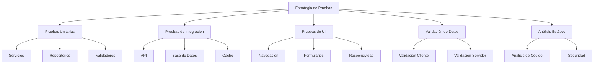

# Pruebas y Validación del Sistema

## Resumen

Este documento describe la estrategia de pruebas y validación implementada en el sistema de gestión de tareas, incluyendo los diferentes tipos de pruebas, herramientas utilizadas, y ejemplos de implementación.

## Estrategia de Pruebas

El sistema implementa una estrategia de pruebas en múltiples niveles para garantizar la calidad, fiabilidad y seguridad del código:



## Tipos de Pruebas

### 1. Pruebas Unitarias

Las pruebas unitarias verifican el funcionamiento correcto de componentes individuales del sistema de forma aislada.

#### Herramientas Utilizadas

- **xUnit**: Framework de pruebas para .NET.
- **Moq**: Biblioteca para crear objetos simulados (mocks).
- **FluentAssertions**: Biblioteca para escribir aserciones más legibles.

#### Ejemplos de Pruebas Unitarias

##### Pruebas del Validador de Tareas

```csharp
// Tests/UnitTests/TodoTaskValidatorTests.cs
public class TodoTaskValidatorTests
{
    private readonly TodoTaskValidator _validator;

    public TodoTaskValidatorTests()
    {
        _validator = new TodoTaskValidator();
    }

    [Fact]
    public void Validate_EmptyDescription_ShouldHaveError()
    {
        // Arrange
        var task = new TodoTask { Description = "" };

        // Act
        var result = _validator.Validate(task);

        // Assert
        result.IsValid.Should().BeFalse();
        result.Errors.Should().Contain(e => e.PropertyName == "Description");
    }

    [Fact]
    public void Validate_DescriptionTooShort_ShouldHaveError()
    {
        // Arrange
        var task = new TodoTask { Description = "AB" }; // Menos de 3 caracteres

        // Act
        var result = _validator.Validate(task);

        // Assert
        result.IsValid.Should().BeFalse();
        result.Errors.Should().Contain(e => e.PropertyName == "Description");
    }

    [Fact]
    public void Validate_ValidDescription_ShouldNotHaveDescriptionError()
    {
        // Arrange
        var task = new TodoTask { Description = "Una tarea válida" };

        // Act
        var result = _validator.Validate(task);

        // Assert
        result.Errors.Should().NotContain(e => e.PropertyName == "Description");
    }

    [Fact]
    public void Validate_PastDueDate_ShouldHaveError()
    {
        // Arrange
        var task = new TodoTask 
        { 
            Description = "Tarea con fecha pasada",
            DueDate = DateTime.UtcNow.AddDays(-1)
        };

        // Act
        var result = _validator.Validate(task);

        // Assert
        result.IsValid.Should().BeFalse();
        result.Errors.Should().Contain(e => e.PropertyName == "DueDate");
    }

    [Fact]
    public void Validate_UrgentTaskWithoutNotes_ShouldHaveError()
    {
        // Arrange
        var task = new TodoTask 
        { 
            Description = "Tarea urgente",
            Priority = Priority.Urgent,
            Notes = null
        };

        // Act
        var result = _validator.Validate(task);

        // Assert
        result.IsValid.Should().BeFalse();
        result.Errors.Should().Contain(e => e.ErrorMessage.Contains("notas explicativas"));
    }

    [Fact]
    public void Validate_UrgentTaskWithNotes_ShouldNotHaveNotesError()
    {
        // Arrange
        var task = new TodoTask 
        { 
            Description = "Tarea urgente",
            Priority = Priority.Urgent,
            Notes = "Esta tarea es urgente porque..."
        };

        // Act
        var result = _validator.Validate(task);

        // Assert
        result.Errors.Should().NotContain(e => e.ErrorMessage.Contains("notas explicativas"));
    }
}
```

##### Pruebas del Servicio de Tareas

```csharp
// Tests/UnitTests/TaskServiceTests.cs
public class TaskServiceTests
{
    private readonly Mock<ITaskRepository> _mockRepository;
    private readonly Mock<ApplicationDbContext> _mockContext;
    private readonly Mock<IHttpContextAccessor> _mockHttpContextAccessor;
    private readonly Mock<ICacheService> _mockCacheService;
    private readonly TaskService _taskService;

    public TaskServiceTests()
    {
        _mockRepository = new Mock<ITaskRepository>();
        _mockContext = new Mock<ApplicationDbContext>();
        _mockHttpContextAccessor = new Mock<IHttpContextAccessor>();
        _mockCacheService = new Mock<ICacheService>();

        _taskService = new TaskService(
            _mockRepository.Object,
            _mockContext.Object,
            _mockHttpContextAccessor.Object,
            _mockCacheService.Object);
    }

    [Fact]
    public void GetTaskById_ExistingId_ShouldReturnTask()
    {
        // Arrange
        var taskId = 1;
        var expectedTask = new TodoTask { Id = taskId, Description = "Tarea de prueba" };
        
        _mockCacheService.Setup(c => c.GetAsync<TodoTask>(It.IsAny<string>()))
            .ReturnsAsync((TodoTask)null);
            
        _mockRepository.Setup(r => r.GetById(taskId))
            .Returns(expectedTask);

        // Act
        var result = _taskService.GetTaskById(taskId);

        // Assert
        result.Should().NotBeNull();
        result.Id.Should().Be(taskId);
        result.Description.Should().Be("Tarea de prueba");
        
        // Verificar que se intentó obtener de la caché
        _mockCacheService.Verify(c => c.GetAsync<TodoTask>($"task_{taskId}"), Times.Once);
        
        // Verificar que se guardó en caché
        _mockCacheService.Verify(c => c.SetAsync(
            $"task_{taskId}", 
            It.Is<TodoTask>(t => t.Id == taskId), 
            It.IsAny<TimeSpan>()), 
            Times.Once);
    }

    [Fact]
    public void GetTaskById_CachedTask_ShouldReturnFromCache()
    {
        // Arrange
        var taskId = 1;
        var cachedTask = new TodoTask { Id = taskId, Description = "Tarea en caché" };
        
        _mockCacheService.Setup(c => c.GetAsync<TodoTask>($"task_{taskId}"))
            .ReturnsAsync(cachedTask);

        // Act
        var result = _taskService.GetTaskById(taskId);

        // Assert
        result.Should().NotBeNull();
        result.Id.Should().Be(taskId);
        result.Description.Should().Be("Tarea en caché");
        
        // Verificar que se obtuvo de la caché
        _mockCacheService.Verify(c => c.GetAsync<TodoTask>($"task_{taskId}"), Times.Once);
        
        // Verificar que no se accedió al repositorio
        _mockRepository.Verify(r => r.GetById(It.IsAny<int>()), Times.Never);
    }

    [Fact]
    public void CreateTask_ValidTask_ShouldAddToRepositoryAndInvalidateCache()
    {
        // Arrange
        var task = new TodoTask { Description = "Nueva tarea" };
        
        _mockRepository.Setup(r => r.Add(It.IsAny<TodoTask>()));
        
        // Mock para AuditLogs
        var mockAuditLogs = new Mock<DbSet<AuditLog>>();
        _mockContext.Setup(c => c.AuditLogs).Returns(mockAuditLogs.Object);

        // Act
        _taskService.CreateTask(task);

        // Assert
        // Verificar que se añadió al repositorio
        _mockRepository.Verify(r => r.Add(task), Times.Once);
        
        // Verificar que se invalidó la caché de categorías
        _mockCacheService.Verify(c => c.RemoveAsync("categories"), Times.Once);
        
        // Verificar que se invalidó la caché de listas de tareas
        _mockCacheService.Verify(c => c.RemoveAsync("tasklist_*"), Times.Once);
    }

    [Fact]
    public void GetTaskList_FromCache_ShouldReturnCachedResult()
    {
        // Arrange
        var filter = new TaskFilter { Status = TodoTaskStatus.Pending };
        var page = 1;
        var pageSize = 10;
        var cacheKey = $"tasklist_{filter.Status}__{filter.Category}_{filter.SearchTerm}_{page}_{pageSize}";
        
        var cachedResult = new TaskListViewModel
        {
            Tasks = new List<TodoTask> { new TodoTask { Id = 1, Description = "Tarea en caché" } },
            Filter = filter,
            Pagination = new PaginationInfo { CurrentPage = page, PageSize = pageSize, TotalItems = 1 }
        };
        
        _mockCacheService.Setup(c => c.GetAsync<TaskListViewModel>(cacheKey))
            .ReturnsAsync(cachedResult);

        // Act
        var result = _taskService.GetTaskList(filter, page, pageSize);

        // Assert
        result.Should().NotBeNull();
        result.Tasks.Should().HaveCount(1);
        result.Tasks.First().Description.Should().Be("Tarea en caché");
        
        // Verificar que se obtuvo de la caché
        _mockCacheService.Verify(c => c.GetAsync<TaskListViewModel>(cacheKey), Times.Once);
        
        // Verificar que no se accedió al repositorio
        _mockRepository.Verify(r => r.GetAll(It.IsAny<TaskFilter>(), It.IsAny<int>(), It.IsAny<int>()), Times.Never);
    }
}
```

### 2. Pruebas de Integración

Las pruebas de integración verifican que diferentes componentes del sistema funcionan correctamente juntos.

#### Herramientas Utilizadas

- **Microsoft.AspNetCore.Mvc.Testing**: Para pruebas de integración de aplicaciones ASP.NET Core.
- **Microsoft.EntityFrameworkCore.InMemory**: Para pruebas con base de datos en memoria.

#### Ejemplos de Pruebas de Integración

```csharp
// Tests/IntegrationTests/TasksControllerTests.cs
public class TasksControllerTests : IClassFixture<WebApplicationFactory<Program>>
{
    private readonly WebApplicationFactory<Program> _factory;
    private readonly HttpClient _client;

    public TasksControllerTests(WebApplicationFactory<Program> factory)
    {
        // Configurar la fábrica de aplicación web con servicios de prueba
        _factory = factory.WithWebHostBuilder(builder =>
        {
            builder.ConfigureServices(services =>
            {
                // Reemplazar el DbContext con uno en memoria
                services.RemoveAll(typeof(DbContextOptions<ApplicationDbContext>));
                services.AddDbContext<ApplicationDbContext>(options =>
                    options.UseInMemoryDatabase("TestDb"));
                
                // Configurar usuario de prueba
                services.AddScoped<IUserClaimsPrincipalFactory<ApplicationUser>, TestUserClaimsPrincipalFactory>();
                
                // Registrar el servicio de inicialización de datos de prueba
                services.AddScoped<TestDataInitializer>();
                
                // Reemplazar el servicio de caché con uno en memoria
                services.RemoveAll(typeof(IDistributedCache));
                services.AddDistributedMemoryCache();
            });
            
            builder.Configure(app =>
            {
                // Asegurarse de que la base de datos de prueba se inicialice
                using (var scope = app.ApplicationServices.CreateScope())
                {
                    var initializer = scope.ServiceProvider.GetRequiredService<TestDataInitializer>();
                    initializer.Initialize().Wait();
                }
            });
        });
        
        _client = _factory.CreateClient();
    }

    [Fact]
    public async Task Index_ReturnsViewWithTasks()
    {
        // Arrange & Act
        var response = await _client.GetAsync("/Tasks");
        
        // Assert
        response.EnsureSuccessStatusCode();
        var content = await response.Content.ReadAsStringAsync();
        
        // Verificar que la respuesta contiene elementos esperados
        content.Should().Contain("Lista de Tareas");
        content.Should().Contain("Tarea de prueba 1");
    }

    [Fact]
    public async Task Create_ValidTask_RedirectsToIndex()
    {
        // Arrange
        var formData = new Dictionary<string, string>
        {
            ["Description"] = "Nueva tarea de integración",
            ["Priority"] = "Medium",
            ["Category"] = "Pruebas"
        };
        
        var content = new FormUrlEncodedContent(formData);
        
        // Act
        var response = await _client.PostAsync("/Tasks/Create", content);
        
        // Assert
        response.StatusCode.Should().Be(HttpStatusCode.Redirect);
        response.Headers.Location.ToString().Should().Contain("/Tasks");
        
        // Verificar que la tarea se creó
        var indexResponse = await _client.GetAsync("/Tasks");
        var indexContent = await indexResponse.Content.ReadAsStringAsync();
        indexContent.Should().Contain("Nueva tarea de integración");
    }

    [Fact]
    public async Task Create_InvalidTask_ReturnsViewWithErrors()
    {
        // Arrange
        var formData = new Dictionary<string, string>
        {
            ["Description"] = "", // Descripción vacía (inválida)
            ["Priority"] = "Medium"
        };
        
        var content = new FormUrlEncodedContent(formData);
        
        // Act
        var response = await _client.PostAsync("/Tasks/Create", content);
        
        // Assert
        response.StatusCode.Should().Be(HttpStatusCode.OK); // No redirecciona
        var responseContent = await response.Content.ReadAsStringAsync();
        responseContent.Should().Contain("La descripción es obligatoria");
    }

    [Fact]
    public async Task Edit_ExistingTask_UpdatesAndRedirects()
    {
        // Arrange
        var taskId = 1; // ID de una tarea existente en los datos de prueba
        
        // Primero, obtener el formulario para capturar el token anti-falsificación
        var getResponse = await _client.GetAsync($"/Tasks/Edit/{taskId}");
        var getContent = await getResponse.Content.ReadAsStringAsync();
        
        // Extraer el token anti-falsificación
        var antiForgeryToken = ExtractAntiForgeryToken(getContent);
        
        var formData = new Dictionary<string, string>
        {
            ["Id"] = taskId.ToString(),
            ["Description"] = "Tarea actualizada",
            ["Priority"] = "High",
            ["Category"] = "Pruebas",
            ["__RequestVerificationToken"] = antiForgeryToken
        };
        
        var content = new FormUrlEncodedContent(formData);
        
        // Act
        var response = await _client.PostAsync($"/Tasks/Edit/{taskId}", content);
        
        // Assert
        response.StatusCode.Should().Be(HttpStatusCode.Redirect);
        
        // Verificar que la tarea se actualizó
        var indexResponse = await _client.GetAsync("/Tasks");
        var indexContent = await indexResponse.Content.ReadAsStringAsync();
        indexContent.Should().Contain("Tarea actualizada");
    }

    // Método auxiliar para extraer el token anti-falsificación
    private string ExtractAntiForgeryToken(string htmlContent)
    {
        var match = Regex.Match(htmlContent, @"<input[^>]*name=""__RequestVerificationToken""[^>]*value=""([^""]+)""");
        return match.Success ? match.Groups[1].Value : null;
    }
}

// Clase auxiliar para inicializar datos de prueba
public class TestDataInitializer
{
    private readonly ApplicationDbContext _context;
    private readonly UserManager<ApplicationUser> _userManager;

    public TestDataInitializer(
        ApplicationDbContext context,
        UserManager<ApplicationUser> userManager)
    {
        _context = context;
        _userManager = userManager;
    }

    public async Task Initialize()
    {
        // Crear usuario de prueba si no existe
        var testUser = await _userManager.FindByNameAsync("test@example.com");
        if (testUser == null)
        {
            testUser = new ApplicationUser
            {
                UserName = "test@example.com",
                Email = "test@example.com",
                EmailConfirmed = true
            };
            
            await _userManager.CreateAsync(testUser, "Test123!");
        }

        // Crear tareas de prueba si no existen
        if (!_context.Tasks.Any())
        {
            _context.Tasks.AddRange(
                new TodoTask
                {
                    Id = 1,
                    Description = "Tarea de prueba 1",
                    Status = TodoTaskStatus.Pending,
                    Priority = Priority.Medium,
                    Category = "Pruebas",
                    CreatedAt = DateTime.UtcNow
                },
                new TodoTask
                {
                    Id = 2,
                    Description = "Tarea de prueba 2",
                    Status = TodoTaskStatus.InProgress,
                    Priority = Priority.High,
                    Category = "Pruebas",
                    CreatedAt = DateTime.UtcNow
                },
                new TodoTask
                {
                    Id = 3,
                    Description = "Tarea de prueba 3",
                    Status = TodoTaskStatus.Completed,
                    Priority = Priority.Low,
                    Category = "Pruebas",
                    CreatedAt = DateTime.UtcNow.AddDays(-1)
                }
            );
            
            await _context.SaveChangesAsync();
        }
    }
}

// Fábrica de claims para usuario de prueba
public class TestUserClaimsPrincipalFactory : IUserClaimsPrincipalFactory<ApplicationUser>
{
    public Task<ClaimsPrincipal> CreateAsync(ApplicationUser user)
    {
        var identity = new ClaimsIdentity(new[]
        {
            new Claim(ClaimTypes.Name, user.UserName),
            new Claim(ClaimTypes.NameIdentifier, user.Id),
            new Claim(ClaimTypes.Email, user.Email)
        }, "Test");

        return Task.FromResult(new ClaimsPrincipal(identity));
    }
}
```

### 3. Pruebas de UI

Las pruebas de UI verifican que la interfaz de usuario funciona correctamente y proporciona una buena experiencia al usuario.

#### Herramientas Utilizadas

- **Selenium WebDriver**: Para automatizar pruebas en navegadores web.
- **xUnit**: Como framework de pruebas.

#### Ejemplos de Pruebas de UI

```csharp
// Tests/UITests/TasksUITests.cs
public class TasksUITests : IClassFixture<WebApplicationFactory<Program>>, IDisposable
{
    private readonly WebApplicationFactory<Program> _factory;
    private readonly IWebDriver _driver;
    private readonly string _baseUrl;

    public TasksUITests(WebApplicationFactory<Program> factory)
    {
        _factory = factory;
        
        // Configurar el servidor de prueba
        _factory = factory.WithWebHostBuilder(builder =>
        {
            builder.ConfigureServices(services =>
            {
                // Configuración similar a las pruebas de integración
                services.RemoveAll(typeof(DbContextOptions<ApplicationDbContext>));
                services.AddDbContext<ApplicationDbContext>(options =>
                    options.UseInMemoryDatabase("UITestDb"));
                
                services.AddScoped<TestDataInitializer>();
            });
            
            builder.Configure(app =>
            {
                using (var scope = app.ApplicationServices.CreateScope())
                {
                    var initializer = scope.ServiceProvider.GetRequiredService<TestDataInitializer>();
                    initializer.Initialize().Wait();
                }
            });
        });
        
        // Iniciar el servidor
        var server = _factory.Server;
        _baseUrl = server.BaseAddress.ToString();
        
        // Configurar el driver de Selenium
        var options = new ChromeOptions();
        options.AddArgument("--headless"); // Modo sin interfaz gráfica para CI/CD
        options.AddArgument("--no-sandbox");
        options.AddArgument("--disable-dev-shm-usage");
        
        _driver = new ChromeDriver(options);
    }

    [Fact]
    public void TasksList_DisplaysTasksAndPagination()
    {
        // Arrange & Act
        _driver.Navigate().GoToUrl($"{_baseUrl}Tasks");
        
        // Assert
        // Verificar que la página carga correctamente
        _driver.Title.Should().Contain("Tareas");
        
        // Verificar que se muestran las tareas
        var taskElements = _driver.FindElements(By.CssSelector(".task-card"));
        taskElements.Should().HaveCountGreaterThan(0);
        
        // Verificar que existe la paginación
        var paginationElement = _driver.FindElement(By.CssSelector(".pagination"));
        paginationElement.Should().NotBeNull();
    }

    [Fact]
    public void CreateTask_SubmitsFormAndCreatesTask()
    {
        // Arrange
        _driver.Navigate().GoToUrl($"{_baseUrl}Tasks/Create");
        
        // Act
        // Rellenar el formulario
        _driver.FindElement(By.Id("Description")).SendKeys("Tarea de prueba UI");
        
        var prioritySelect = new SelectElement(_driver.FindElement(By.Id("Priority")));
        prioritySelect.SelectByText("Alta");
        
        _driver.FindElement(By.Id("Category")).SendKeys("UI Tests");
        
        // Enviar el formulario
        _driver.FindElement(By.CssSelector("button[type='submit']")).Click();
        
        // Assert
        // Verificar que redirige a la lista de tareas
        _driver.Url.Should().Contain("/Tasks");
        
        // Verificar que muestra mensaje de éxito
        var alertSuccess = _driver.FindElement(By.CssSelector(".alert-success"));
        alertSuccess.Text.Should().Contain("exitosamente");
        
        // Verificar que la tarea aparece en la lista
        var taskElements = _driver.FindElements(By.CssSelector(".task-card"));
        var taskTexts = taskElements.Select(e => e.Text).ToList();
        taskTexts.Should().Contain(t => t.Contains("Tarea de prueba UI"));
    }

    [Fact]
    public void CreateTask_WithInvalidData_ShowsValidationErrors()
    {
        // Arrange
        _driver.Navigate().GoToUrl($"{_baseUrl}Tasks/Create");
        
        // Act
        // Enviar el formulario sin rellenar campos obligatorios
        _driver.FindElement(By.CssSelector("button[type='submit']")).Click();
        
        // Assert
        // Verificar que muestra errores de validación
        var validationSummary = _driver.FindElement(By.CssSelector(".validation-summary-errors"));
        validationSummary.Should().NotBeNull();
        validationSummary.Text.Should().Contain("La descripción es obligatoria");
    }

    [Fact]
    public void FilterTasks_AppliesFilterAndShowsResults()
    {
        // Arrange
        _driver.Navigate().GoToUrl($"{_baseUrl}Tasks");
        
        // Act
        // Aplicar filtro por estado
        var statusSelect = new SelectElement(_driver.FindElement(By.Id("Filter_Status")));
        statusSelect.SelectByValue("InProgress");
        
        // Hacer clic en el botón de filtrar
        _driver.FindElement(By.Id("btnFilter")).Click();
        
        // Assert
        // Verificar que la URL contiene el parámetro de filtro
        _driver.Url.Should().Contain("Status=InProgress");
        
        // Verificar que solo se muestran tareas en progreso
        var taskElements = _driver.FindElements(By.CssSelector(".task-card"));
        foreach (var task in taskElements)
        {
            task.FindElement(By.CssSelector(".badge")).Text.Should().Contain("En Progreso");
        }
    }

    public void Dispose()
    {
        _driver?.Quit();
        _driver?.Dispose();
    }
}
```

### 4. Validación de Datos

El sistema implementa validación de datos tanto en el cliente como en el servidor para garantizar la integridad y seguridad de los datos.

#### Validación en el Cliente

La validación en el cliente se implementa utilizando:

- **Atributos de validación de datos**: Para validación básica.
- **jQuery Validation**: Para validación más avanzada.
- **JavaScript personalizado**: Para validaciones específicas.

```html
<!-- Ejemplo de validación en el cliente en Create.cshtml -->
<form asp-action="Create" id="taskForm">
    <div class="form-group">
        <label asp-for="Description" class="control-label"></label>
        <input asp-for="Description" class="form-control" />
        <span asp-validation-for="Description" class="text-danger"></span>
    </div>
    
    <div class="form-group">
        <label asp-for="Priority" class="control-label"></label>
        <select asp-for="Priority" class="form-control" 
                asp-items="Html.GetEnumSelectList<Priority>()"></select>
        <span asp-validation-for="Priority" class="text-danger"></span>
    </div>
    
    <div class="form-group">
        <label asp-for="DueDate" class="control-label"></label>
        <input asp-for="DueDate" class="form-control" type="date" />
        <span asp-validation-for="DueDate" class="text-danger"></span>
    </div>
    
    <div class="form-group">
        <label asp-for="Category" class="control-label"></label>
        <input asp-for="Category" class="form-control" list="categories" />
        <datalist id="categories">
            @foreach (var category in ViewBag.Categories)
            {
                <option value="@category"></option>
            }
        </datalist>
        <span asp-validation-for="Category" class="text-danger"></span>
    </div>
    
    <div class="form-group">
        <label asp-for="Notes" class="control-label"></label>
        <textarea asp-for="Notes" class="form-control" rows="3"></textarea>
        <span asp-validation-for="Notes" class="text-danger"></span>
    </div>
    
    <div class="form-group">
        <button type="submit" class="btn btn-primary">Crear</button>
        <a asp-action="Index" class="btn btn-secondary">Cancelar</a>
    </div>
</form>

@section Scripts {
    @{await Html.RenderPartialAsync("_ValidationScriptsPartial");}
    
    <script>
        $(document).ready(function() {
            // Validación personalizada para tareas urgentes
            $.validator.addMethod("requireNotesForUrgent", function(value, element) {
                var priority = $("#Priority").val();
                var notes = $("#Notes").val();
                
                return priority !== "3" || (notes && notes.trim().length > 0);
            }, "Las tareas urgentes requieren notas explicativas");
            
            // Añadir regla personalizada al formulario
            $("#taskForm").validate({
                rules: {
                    Notes: {
                        requireNotesForUrgent: true
                    }
                }
            });
            
            // Validación dinámica al cambiar la prioridad
            $("#Priority").change(function() {
                $("#Notes").valid();
            });
        });
    </script>
}
```

#### Validación en el Servidor

La validación en el servidor se implementa utilizando:

- **FluentValidation**: Para validaciones complejas y reglas de negocio.
- **Sanitización de datos**: Para prevenir ataques XSS y otros.

```csharp
// Ejemplo de validación en el servidor en TasksController.cs
[HttpPost]
[ValidateAntiForgeryToken]
public IActionResult Create(TodoTask task)
{
    try
    {
        // Validación con FluentValidation
        ValidationResult validationResult = _taskValidator.Validate(task);
        
        if (validationResult.IsValid)
        {
            // Sanitización de datos
            SanitizeTaskProperties(task);
            
            // Creación de la tarea
            _taskService.CreateTask(task);
            
            TempData["Success"] = "Tarea creada exitosamente.";
            return RedirectToAction(nameof(Index));
        }
        
        // Añadir errores de validación al ModelState
        foreach (var error in validationResult.Errors)
        {
            ModelState.AddModelError(error.PropertyName, error.ErrorMessage);
        }
        
        // Volver a la vista con errores
        PopulateCategories();
        return View(task);
    }
    catch (Exception ex)
    {
        _logger.LogError(ex, "Error al crear la tarea");
        ModelState.AddModelError(string.Empty, "Ha ocurrido un error al crear la tarea.");
        PopulateCategories();
        return View(task);
    }
}
```

### 5. Análisis Estático de Código

El sistema utiliza herramientas de análisis estático para detectar problemas potenciales en el código antes de que lleguen a producción.

#### Herramientas Utilizadas

- **StyleCop**: Para verificar el cumplimiento de estándares de codificación.
- **SonarQube**: Para análisis de calidad de código y seguridad.
- **Security Code
