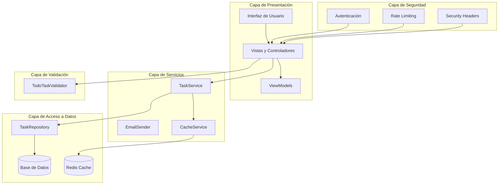
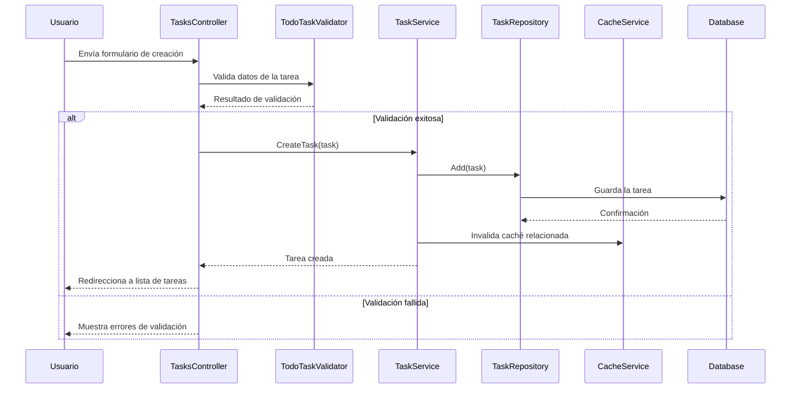
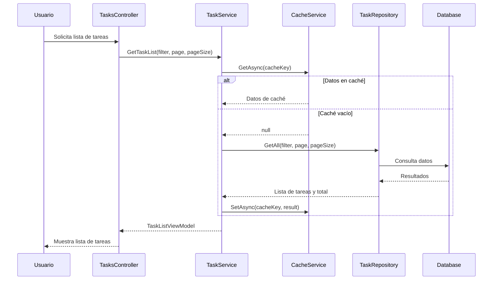
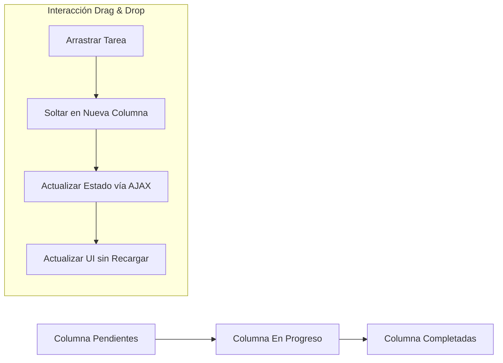

# Documentación del Sistema de Gestión de Tareas

## Introducción

Esta carpeta contiene la documentación completa del sistema de gestión de tareas. La documentación está organizada en diferentes archivos que cubren aspectos específicos del sistema, desde la arquitectura general hasta detalles de implementación de componentes específicos.

## Índice de Documentación

### 1. [Arquitectura General](./ArquitecturaGeneral.md)

Este documento describe la arquitectura general del sistema, incluyendo:
- Diagrama de arquitectura en capas
- Componentes principales
- Patrones de diseño utilizados
- Flujos de datos principales
- Consideraciones de rendimiento
- Ejemplos de uso
- Extensibilidad

### 2. [Implementación de Caché](./ImplementacionCache.md)

Este documento detalla la implementación del sistema de caché, incluyendo:
- Resumen de la solución
- Componentes implementados
- Configuración de Redis
- Interfaz de caché
- Implementación con Redis y fallback a memoria
- Integración en el servicio de tareas
- Beneficios
- Consideraciones para producción

### 3. [Seguridad y Mejores Prácticas](./SeguridadYMejoresPracticas.md)

Este documento describe las medidas de seguridad implementadas, incluyendo:
- Autenticación y autorización
- Protección contra vulnerabilidades web comunes
- Validación y sanitización de datos
- Auditoría y registro
- Gestión de errores y excepciones
- Mejores prácticas de seguridad
- Ejemplos de implementación

### 4. [Pruebas y Validación](./PruebasYValidacion.md)

Este documento detalla la estrategia de pruebas y validación, incluyendo:
- Estrategia de pruebas
- Pruebas unitarias
- Pruebas de integración
- Pruebas de UI
- Validación de datos
- Análisis estático de código
- Ejemplos de implementación

### 5. [Mejoras en la Interfaz de Usuario](./MejorasInterfazUsuario.md)

Este documento describe las mejoras implementadas en la interfaz de usuario, incluyendo:
- Diseño visual modernizado
- Vista Kanban con funcionalidad de drag & drop
- Tarjetas de tareas mejoradas
- Actualizaciones dinámicas de la interfaz
- Sistema de notificaciones mejorado
- Optimizaciones para dispositivos móviles
- Beneficios para el usuario
- Comparativa antes y después
- Tecnologías utilizadas
- Consideraciones futuras

## Diagramas

La documentación incluye varios diagramas para facilitar la comprensión del sistema:

### Diagrama de Arquitectura

### Flujo de Creación de Tareas

### Flujo de Consulta con Caché

### Diagrama de Interacción Drag & Drop

## Cómo Usar Esta Documentación

1. Comience con el documento de [Arquitectura General](./ArquitecturaGeneral.md) para obtener una visión general del sistema.
2. Explore los documentos específicos según sus necesidades:
   - Para entender el rendimiento y escalabilidad: [Implementación de Caché](./ImplementacionCache.md)
   - Para aspectos de seguridad: [Seguridad y Mejores Prácticas](./SeguridadYMejoresPracticas.md)
   - Para calidad y pruebas: [Pruebas y Validación](./PruebasYValidacion.md)
   - Para mejoras en la interfaz de usuario: [Mejoras en la Interfaz de Usuario](./MejorasInterfazUsuario.md)
3. Utilice los ejemplos de código y diagramas como referencia para implementar o modificar funcionalidades.

## Mantenimiento de la Documentación

Esta documentación debe mantenerse actualizada cuando se realicen cambios significativos en el sistema. Al implementar nuevas funcionalidades o modificar las existentes, asegúrese de:

1. Actualizar los documentos relevantes.
2. Mantener los diagramas sincronizados con la implementación actual.
3. Añadir ejemplos de código para nuevas funcionalidades.
4. Documentar las decisiones de diseño importantes.

## Herramientas Utilizadas

La documentación utiliza las siguientes herramientas:

- **Markdown**: Para el formato de texto.
- **Mermaid**: Para la generación de diagramas.
- **Bloques de código**: Para ejemplos de implementación.

## Contribuciones

Para contribuir a esta documentación:

1. Siga el mismo formato y estilo que los documentos existentes.
2. Incluya diagramas cuando sea apropiado para visualizar conceptos complejos.
3. Proporcione ejemplos de código concretos y explicaciones claras.
4. Revise y actualice los documentos existentes cuando sea necesario.
