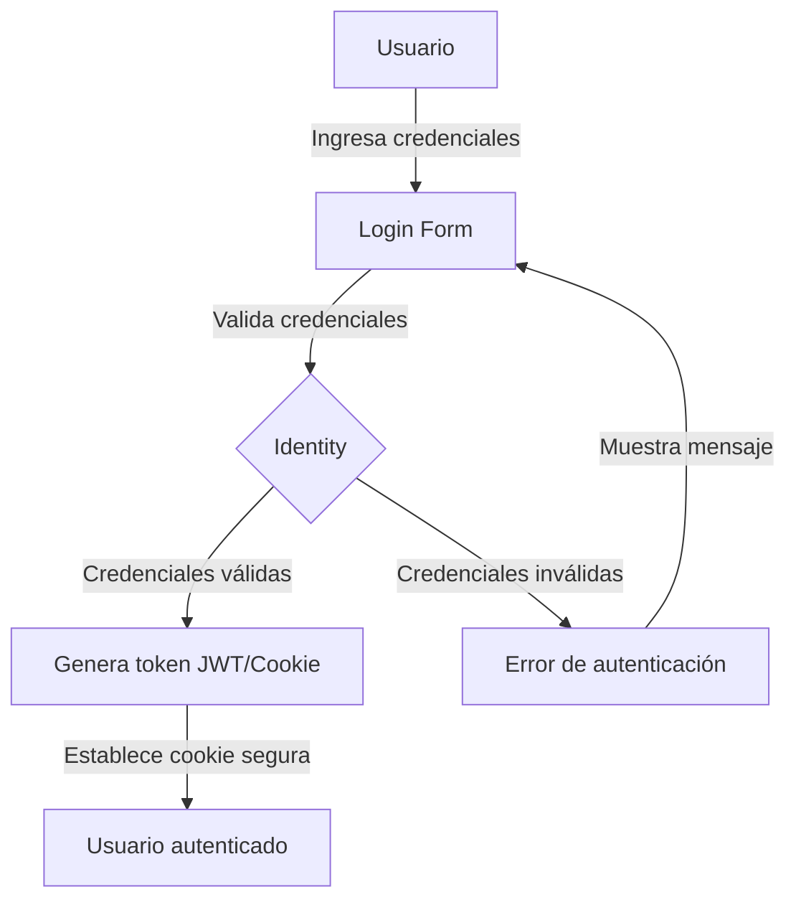

# Seguridad y Mejores Prácticas

## Resumen

Este documento describe las medidas de seguridad y mejores prácticas implementadas en el sistema de gestión de tareas para proteger los datos, prevenir vulnerabilidades comunes y garantizar un funcionamiento seguro y confiable.

## Medidas de Seguridad Implementadas

### 1. Autenticación y Autorización

El sistema utiliza ASP.NET Core Identity para la gestión de usuarios, autenticación y autorización, proporcionando un marco robusto y seguro para estas funcionalidades críticas.

#### Autenticación



- **Almacenamiento seguro de contraseñas**: Las contraseñas se almacenan utilizando algoritmos de hash seguros (PBKDF2 con HMAC-SHA256) con sal única por usuario.
- **Políticas de contraseñas**: Se aplican políticas que requieren contraseñas fuertes con una combinación de caracteres, longitud mínima y complejidad.
- **Bloqueo de cuentas**: Después de varios intentos fallidos de inicio de sesión, las cuentas se bloquean temporalmente para prevenir ataques de fuerza bruta.
- **Autenticación de dos factores (2FA)**: Soporte para autenticación de dos factores utilizando aplicaciones de autenticación o SMS.

#### Autorización

- **Autorización basada en roles**: Los usuarios tienen roles asignados (Administrador, Usuario, etc.) que determinan sus permisos.
- **Autorización a nivel de controlador y acción**: Uso de atributos `[Authorize]` para restringir el acceso a controladores y acciones específicas.
- **Autorización a nivel de recurso**: Verificación de que los usuarios solo pueden acceder a sus propios recursos.

```csharp
// Ejemplo de autorización a nivel de controlador
[Authorize]
public class TasksController : Controller
{
    // Solo usuarios autenticados pueden acceder
}

// Ejemplo de autorización basada en roles
[Authorize(Roles = "Admin")]
public IActionResult AdminDashboard()
{
    // Solo administradores pueden acceder
}
```

### 2. Protección contra Vulnerabilidades Web Comunes

#### Inyección SQL

- **Entity Framework Core**: Uso de Entity Framework Core con parámetros para prevenir inyección SQL.
- **Validación de entrada**: Todos los datos de entrada son validados antes de ser procesados.

```csharp
// Ejemplo seguro usando Entity Framework Core
var tasks = _context.Tasks
    .Where(t => t.UserId == userId && t.Status == status)
    .ToList();

// En lugar de concatenación de strings (vulnerable)
// string query = "SELECT * FROM Tasks WHERE UserId = '" + userId + "' AND Status = '" + status + "'";
```

#### Cross-Site Scripting (XSS)

- **Codificación automática**: ASP.NET Core codifica automáticamente la salida en vistas Razor.
- **Sanitización de entrada**: Todos los datos de entrada son sanitizados para eliminar scripts maliciosos.
- **Content Security Policy (CSP)**: Implementación de políticas CSP para restringir fuentes de contenido.

```csharp
// Ejemplo de sanitización de entrada en el modelo TodoTask
public void SanitizeAllProperties()
{
    Description = SanitizeInput(Description);
    
    if (!string.IsNullOrEmpty(Category))
        Category = SanitizeInput(Category);
    
    if (!string.IsNullOrEmpty(Notes))
        Notes = SanitizeInput(Notes);
}

private string SanitizeInput(string input)
{
    if (string.IsNullOrEmpty(input))
        return string.Empty;

    // Eliminar etiquetas HTML potencialmente peligrosas
    var sanitized = Regex.Replace(input, @"<[^>]*>", string.Empty);
    
    // Eliminar scripts potencialmente peligrosos
    sanitized = Regex.Replace(sanitized, @"javascript:", "blocked:", RegexOptions.IgnoreCase);
    sanitized = Regex.Replace(sanitized, @"on\w+\s*=", "blocked=", RegexOptions.IgnoreCase);
    
    // Eliminar URLs potencialmente peligrosas
    sanitized = Regex.Replace(sanitized, @"data:text/html", "blocked:", RegexOptions.IgnoreCase);
    
    // Codificar caracteres especiales
    sanitized = System.Web.HttpUtility.HtmlEncode(sanitized);
    
    return sanitized;
}
```

#### Cross-Site Request Forgery (CSRF)

- **Tokens antifalsificación**: Uso de tokens antifalsificación en todos los formularios.
- **Validación automática**: Uso del atributo `[ValidateAntiForgeryToken]` en todas las acciones POST.

```csharp
// En el controlador
[HttpPost]
[ValidateAntiForgeryToken]
public IActionResult Create(TodoTask task)
{
    // Procesamiento seguro...
}

// En la vista
<form asp-action="Create">
    @Html.AntiForgeryToken()
    <!-- Campos del formulario -->
</form>
```

#### Exposición de Datos Sensibles

- **HTTPS**: Toda la comunicación se realiza a través de HTTPS.
- **Encabezados de seguridad**: Implementación de encabezados HTTP de seguridad.
- **Datos sensibles**: Los datos sensibles no se almacenan en cookies o localStorage.

```csharp
// Configuración de HTTPS en Program.cs
var app = builder.Build();

if (!app.Environment.IsDevelopment())
{
    app.UseExceptionHandler("/Home/Error");
    app.UseHsts(); // Habilita HTTP Strict Transport Security
}

app.UseHttpsRedirection(); // Redirecciona HTTP a HTTPS
```

#### Middleware de Seguridad

Se ha implementado middleware personalizado para añadir capas adicionales de seguridad:

```csharp
// Middleware para añadir encabezados de seguridad
public class SecurityHeadersMiddleware
{
    private readonly RequestDelegate _next;

    public SecurityHeadersMiddleware(RequestDelegate next)
    {
        _next = next;
    }

    public async Task InvokeAsync(HttpContext context)
    {
        // Añadir encabezados de seguridad
        context.Response.Headers.Add("X-Content-Type-Options", "nosniff");
        context.Response.Headers.Add("X-Frame-Options", "DENY");
        context.Response.Headers.Add("X-XSS-Protection", "1; mode=block");
        context.Response.Headers.Add("Referrer-Policy", "strict-origin-when-cross-origin");
        context.Response.Headers.Add("Content-Security-Policy", 
            "default-src 'self'; " +
            "script-src 'self' https://cdn.jsdelivr.net; " +
            "style-src 'self' https://cdn.jsdelivr.net; " +
            "img-src 'self' data:; " +
            "font-src 'self' https://cdn.jsdelivr.net; " +
            "connect-src 'self'; " +
            "frame-ancestors 'none'; " +
            "form-action 'self';");

        await _next(context);
    }
}

// Middleware para limitar la tasa de solicitudes
public class RateLimitingMiddleware
{
    private static readonly Dictionary<string, TokenBucket> _buckets = new();
    private static readonly SemaphoreSlim _semaphore = new(1, 1);
    private readonly RequestDelegate _next;
    private readonly ILogger<RateLimitingMiddleware> _logger;
    
    // Configuración: 100 solicitudes por minuto por IP
    private const int TokensPerMinute = 100;
    private const int BucketCapacity = 100;
    
    // Implementación...
}
```

### 3. Validación y Sanitización de Datos

#### Validación con FluentValidation

El sistema utiliza FluentValidation para implementar reglas de validación robustas y extensibles:

```csharp
public class TodoTaskValidator : AbstractValidator<TodoTask>
{
    public TodoTaskValidator()
    {
        // Validación de la descripción
        RuleFor(task => task.Description)
            .NotEmpty().WithMessage("La descripción es obligatoria")
            .Length(3, 200).WithMessage("La descripción debe tener entre 3 y 200 caracteres")
            .Must(BeValidText).WithMessage("La descripción contiene caracteres no permitidos");

        // Validación de la fecha de vencimiento
        RuleFor(task => task.DueDate)
            .Must(BeAFutureDate).When(task => task.DueDate.HasValue)
            .WithMessage("La fecha de vencimiento debe ser futura");

        // Validación de la categoría
        RuleFor(task => task.Category)
            .MaximumLength(50).WithMessage("La categoría no puede exceder los 50 caracteres")
            .Must(BeValidCategory).When(task => !string.IsNullOrEmpty(task.Category))
            .WithMessage("La categoría debe ser una palabra o frase corta sin caracteres especiales");

        // Otras reglas de validación...
    }
    
    // Métodos de validación personalizados...
}
```

#### Sanitización de Datos

Además de la validación, todos los datos de entrada son sanitizados para prevenir ataques:

```csharp
// En el controlador
[HttpPost]
[ValidateAntiForgeryToken]
public IActionResult Create(TodoTask task)
{
    // Validación con FluentValidation
    ValidationResult validationResult = _taskValidator.Validate(task);
    
    if (validationResult.IsValid)
    {
        // Sanitización de datos antes de guardar
        SanitizeTaskProperties(task);
        _taskService.CreateTask(task);
        // ...
    }
    // ...
}

private void SanitizeTaskProperties(TodoTask task)
{
    // Llama al método de sanitización del modelo
    task.SanitizeAllProperties();
}
```

### 4. Auditoría y Registro

El sistema implementa un mecanismo de auditoría para registrar todas las acciones importantes:

```csharp
// En TaskService.cs
private void CreateAuditLog(string action, TodoTask task, TodoTask oldTask = null)
{
    var user = _httpContextAccessor.HttpContext?.User;
    var userId = user?.FindFirst(System.Security.Claims.ClaimTypes.NameIdentifier)?.Value;
    var userName = user?.Identity?.Name;

    var changes = string.Empty;
    if (oldTask != null)
    {
        var changedProperties = new Dictionary<string, object>();
        if (oldTask.Description != task.Description)
            changedProperties["Description"] = task.Description;
        // Otras propiedades...

        if (changedProperties.Count > 0)
            changes = JsonSerializer.Serialize(changedProperties);
    }

    var auditLog = new AuditLog
    {
        EntityName = "TodoTask",
        EntityId = task.Id,
        Action = action,
        Changes = changes,
        UserId = userId,
        UserName = userName,
        Timestamp = DateTime.UtcNow
    };

    _context.AuditLogs.Add(auditLog);
    _context.SaveChanges();
}
```

#### Registro (Logging)

El sistema utiliza el framework de registro de ASP.NET Core para registrar eventos importantes:

```csharp
// En TasksController.cs
public IActionResult Index(TaskFilter filter, int page = 1)
{
    try
    {
        var viewModel = _taskService.GetTaskList(filter, page, DefaultPageSize);
        PopulateCategories();
        return View(viewModel);
    }
    catch (Exception ex)
    {
        _logger.LogError(ex, "Error al obtener la lista de tareas");
        TempData["Error"] = "Ha ocurrido un error al cargar las tareas.";
        return View(new TaskListViewModel());
    }
}
```

### 5. Gestión de Errores y Excepciones

El sistema implementa una gestión centralizada de errores para capturar y manejar excepciones de forma segura:

```csharp
// En Program.cs
if (!app.Environment.IsDevelopment())
{
    app.UseExceptionHandler("/Home/Error");
    app.UseHsts();
}

// En HomeController.cs
[ResponseCache(Duration = 0, Location = ResponseCacheLocation.None, NoStore = true)]
public IActionResult Error()
{
    var exceptionHandlerPathFeature = HttpContext.Features.Get<IExceptionHandlerPathFeature>();
    var exception = exceptionHandlerPathFeature?.Error;
    
    // Registrar la excepción
    _logger.LogError(exception, "Error no controlado");
    
    // Mostrar vista de error genérica (sin detalles técnicos en producción)
    return View(new ErrorViewModel { RequestId = Activity.Current?.Id ?? HttpContext.TraceIdentifier });
}
```

## Mejores Prácticas de Seguridad

### 1. Principio de Menor Privilegio

El sistema sigue el principio de menor privilegio, asegurando que cada componente tenga solo los permisos necesarios para realizar su función:

- **Roles específicos**: Los usuarios tienen roles específicos con permisos limitados.
- **Acceso a datos filtrado**: Los usuarios solo pueden acceder a sus propios datos.
- **Separación de responsabilidades**: Cada componente tiene una responsabilidad clara y limitada.

### 2. Defensa en Profundidad

El sistema implementa múltiples capas de seguridad para proteger contra diferentes tipos de amenazas:

- **Validación en el cliente**: Primera línea de defensa para mejorar la experiencia del usuario.
- **Validación en el servidor**: Validación rigurosa de todos los datos recibidos.
- **Sanitización de datos**: Limpieza de datos potencialmente peligrosos.
- **Autorización**: Verificación de permisos para cada operación.
- **Auditoría**: Registro de todas las acciones importantes.

### 3. Actualizaciones y Parches

El sistema está diseñado para facilitar la aplicación de actualizaciones y parches de seguridad:

- **Dependencias actualizadas**: Uso de las versiones más recientes de los paquetes NuGet.
- **Monitoreo de vulnerabilidades**: Uso de herramientas para detectar vulnerabilidades en dependencias.
- **Proceso de actualización documentado**: Procedimientos claros para aplicar actualizaciones.

### 4. Configuración Segura

El sistema utiliza configuraciones seguras por defecto:

- **Secretos seguros**: Los secretos y claves de API se almacenan de forma segura utilizando User Secrets o Azure Key Vault.
- **Configuración por entorno**: Configuraciones específicas para desarrollo, pruebas y producción.
- **Valores predeterminados seguros**: Las configuraciones predeterminadas priorizan la seguridad sobre la conveniencia.

```csharp
// Ejemplo de configuración segura en Program.cs
var builder = WebApplication.CreateBuilder(args);

// En desarrollo, usar User Secrets
if (builder.Environment.IsDevelopment())
{
    builder.Configuration.AddUserSecrets<Program>();
}
// En producción, usar variables de entorno o Azure Key Vault
else
{
    builder.Configuration.AddEnvironmentVariables();
    
    // Opcional: Azure Key Vault
    if (!string.IsNullOrEmpty(builder.Configuration["KeyVault:Vault"]))
    {
        builder.Configuration.AddAzureKeyVault(
            new Uri($"https://{builder.Configuration["KeyVault:Vault"]}.vault.azure.net/"),
            new DefaultAzureCredential());
    }
}
```

## Ejemplos de Implementación

### Ejemplo 1: Protección contra XSS en la Vista

```html
<!-- Uso seguro de datos en la vista -->
<div class="task-card">
    <h3>@Html.Encode(Model.Description)</h3>
    <p>Categoría: @Html.Encode(Model.Category ?? "Sin categoría")</p>
    <p>Fecha: @Model.DueDate?.ToString("dd/MM/yyyy")</p>
    
    @if (!string.IsNullOrEmpty(Model.Notes))
    {
        <div class="notes">
            <h4>Notas:</h4>
            <p>@Html.Encode(Model.Notes)</p>
        </div>
    }
</div>
```

### Ejemplo 2: Implementación de Rate Limiting

```csharp
public class RateLimitingMiddleware
{
    private static readonly Dictionary<string, TokenBucket> _buckets = new();
    private static readonly SemaphoreSlim _semaphore = new(1, 1);
    private readonly RequestDelegate _next;
    private readonly ILogger<RateLimitingMiddleware> _logger;
    
    // Configuración: 100 solicitudes por minuto por IP
    private const int TokensPerMinute = 100;
    private const int BucketCapacity = 100;
    
    public RateLimitingMiddleware(RequestDelegate next, ILogger<RateLimitingMiddleware> logger)
    {
        _next = next;
        _logger = logger;
    }
    
    public async Task InvokeAsync(HttpContext context)
    {
        // Obtener la IP del cliente
        var clientIp = GetClientIpAddress(context);
        
        // Verificar si el cliente puede realizar la solicitud
        if (await CanProcessRequestAsync(clientIp))
        {
            await _next(context);
        }
        else
        {
            _logger.LogWarning("Rate limit exceeded for IP: {ClientIp}", clientIp);
            
            context.Response.StatusCode = StatusCodes.Status429TooManyRequests;
            context.Response.Headers.Add("Retry-After", "60");
            await context.Response.WriteAsync("Too many requests. Please try again later.");
        }
    }
    
    private async Task<bool> CanProcessRequestAsync(string clientIp)
    {
        await _semaphore.WaitAsync();
        
        try
        {
            // Obtener o crear el bucket para esta IP
            if (!_buckets.TryGetValue(clientIp, out var bucket))
            {
                bucket = new TokenBucket(BucketCapacity, TokensPerMinute);
                _buckets[clientIp] = bucket;
            }
            
            // Intentar consumir un token
            return bucket.TryConsume(1);
        }
        finally
        {
            _semaphore.Release();
        }
    }
    
    private string GetClientIpAddress(HttpContext context)
    {
        // Intentar obtener la IP real detrás de proxies
        var forwardedFor = context.Request.Headers["X-Forwarded-For"].FirstOrDefault();
        
        if (!string.IsNullOrEmpty(forwardedFor))
        {
            // X-Forwarded-For puede contener múltiples IPs, tomamos la primera
            return forwardedFor.Split(',')[0].Trim();
        }
        
        // Si no hay X-Forwarded-For, usar la IP de conexión
        return context.Connection.RemoteIpAddress?.ToString() ?? "unknown";
    }
    
    // Implementación del algoritmo Token Bucket
    private class TokenBucket
    {
        private readonly int _capacity;
        private readonly double _tokensPerSecond;
        private double _tokens;
        private DateTime _lastRefill;
        
        public TokenBucket(int capacity, int tokensPerMinute)
        {
            _capacity = capacity;
            _tokensPerSecond = tokensPerMinute / 60.0;
            _tokens = capacity;
            _lastRefill = DateTime.UtcNow;
        }
        
        public bool TryConsume(int count)
        {
            RefillTokens();
            
            if (_tokens >= count)
            {
                _tokens -= count;
                return true;
            }
            
            return false;
        }
        
        private void RefillTokens()
        {
            var now = DateTime.UtcNow;
            var secondsElapsed = (now - _lastRefill).TotalSeconds;
            
            if (secondsElapsed > 0)
            {
                var tokensToAdd = secondsElapsed * _tokensPerSecond;
                _tokens = Math.Min(_capacity, _tokens + tokensToAdd);
                _lastRefill = now;
            }
        }
    }
}
```

### Ejemplo 3: Implementación de Auditoría

```csharp
// Modelo de AuditLog
public class AuditLog
{
    public int Id { get; set; }
    
    [Required]
    [MaxLength(50)]
    public string EntityName { get; set; } = string.Empty;
    
    public int EntityId { get; set; }
    
    [Required]
    [MaxLength(50)]
    public string Action { get; set; } = string.Empty;
    
    public string? Changes { get; set; }
    
    public string? UserId { get; set; }
    
    public string? UserName { get; set; }
    
    [Required]
    public DateTime Timestamp { get; set; } = DateTime.UtcNow;
    
    [MaxLength(100)]
    public string? IpAddress { get; set; }
    
    [MaxLength(2000)]
    public string? UserAgent { get; set; }
}

// Uso en el servicio
public void UpdateTask(TodoTask task)
{
    var oldTask = _taskRepository.GetById(task.Id);
    _taskRepository.Update(task);
    
    // Registrar la acción en el log de auditoría
    CreateAuditLog("Update", task, oldTask);
    
    // Invalidar caché
    _cacheService.RemoveAsync($"task_{task.Id}");
    if (oldTask.Category != task.Category)
    {
        _cacheService.RemoveAsync("categories");
    }
    InvalidateTaskListCache();
}
```

## Conclusión

La seguridad es un aspecto fundamental del sistema de gestión de tareas. A través de la implementación de múltiples capas de protección, validación rigurosa de datos, auditoría completa y seguimiento de mejores prácticas, el sistema proporciona un entorno seguro para los usuarios y sus datos.

La documentación detallada de estas medidas de seguridad facilita la comprensión del sistema para nuevos desarrolladores y proporciona una referencia para mantener y mejorar la seguridad a lo largo del tiempo.
